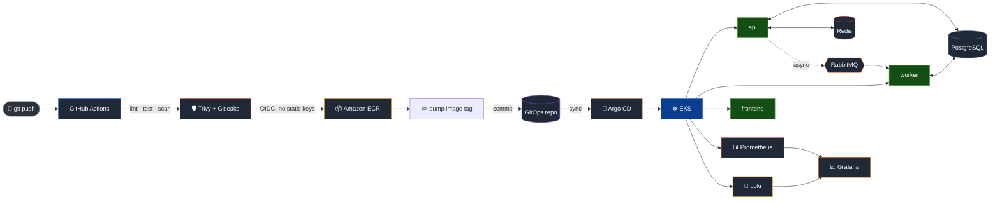

<div align="center">

<br>

# ⚒️ KubeForge

### A production-shaped AWS/Kubernetes platform, built one real failure at a time

<br>


<br>

*Every metric on this page came from a real command, run against real infrastructure.*
*Nothing here was estimated, assumed, or written before it was tested.*

<br>

</div>

<br>

## 📖 Table of Contents

- [What This Actually Is](#-what-this-actually-is)
- [System Architecture](#️-system-architecture)
- [Tech Stack](#-tech-stack)
- [By The Numbers](#-by-the-numbers)
- [The Twelve Phases](#️-the-twelve-phases)
- [Three Stories Worth Reading](#-three-stories-worth-reading)
- [Project Structure](#-project-structure)
- [Getting Started](#-getting-started)
- [Documentation Index](#-documentation-index)
- [Deliberately Not Built](#-deliberately-not-built)

<br>

---

<br>

## 🧭 What This Actually Is

Three small Node.js services — `api`, `worker`, `frontend` — that don't matter very much on their own. A task gets created, a message goes on a queue, a worker picks it up, a status changes. If that were the whole project, it would be a weekend's work.

What actually took twelve phases is everything *around* those three services: real AWS infrastructure provisioned entirely through Terraform, a CI/CD pipeline that never once needs a static AWS credential, GitOps deployment through Argo CD with drift correction that's been *proven*, not just configured, canary rollouts watched end-to-end through real Kubernetes events, autoscaling verified under real load rather than assumed from a YAML file, and a full metrics-plus-logs observability stack that had to be debugged into existence.

The guiding principle throughout — stated plainly in this project's own architecture doc from day one — was **interview-defensibility**: every claim needs a receipt. Not "I configured autoscaling," but "here's the k6 output showing it happened." Not "NetworkPolicy secures the cluster," but "here's the AWS documentation proving enforcement was off by default, and here's the fix." That constraint shaped almost every decision in this repository, including the decision to stop at twelve phases rather than rushing through twenty just to fill out a roadmap.

If you read nothing else on this page, read [Three Stories Worth Reading](#-three-stories-worth-reading) — that's where the actual engineering lives.

<br>

---

<br>

## 🏗️ System Architecture

<div align="center">



</div>

<br>

Read left to right, this is the entire path a code change takes to become
running infrastructure, with no manual step anywhere in the middle:

A `git push` triggers **GitHub Actions**, which lints, tests, and runs two
separate security scanners — **Trivy** against the built container image,
**Gitleaks** against the diff — before anything gets pushed anywhere. The
image goes to **Amazon ECR** using short-lived credentials obtained through
**OIDC federation**; no AWS access key has ever existed in this repository's
secrets. A final CI job bumps the image tag in a small GitOps
configuration file and commits it back to the repo — and that commit,
not the image push itself, is the actual trigger the rest of the pipeline
is watching for.

**Argo CD** polls that repository, notices the change, and syncs the
cluster to match — pulling from a single Helm chart that renders to 26
real Kubernetes resources. From there, `api` is deployed as an **Argo
Rollout** (canary deployments, not a plain Deployment), `worker` consumes
from **RabbitMQ** and writes back to **PostgreSQL**, and `frontend` serves
static assets. **Prometheus** and **Loki** both run inside the cluster,
feeding one shared **Grafana** instance — metrics and logs, queryable side
by side, not two separate tools someone has to remember to check.

<br>

---

<br>

## 🧰 Tech Stack

<table>
<tr>
<th align="left">Layer</th>
<th align="left">Technology</th>
<th align="left">Why this one, specifically</th>
</tr>
<tr>
<td><b>Application</b></td>
<td>Node.js (ESM), Express, PostgreSQL, Redis, RabbitMQ</td>
<td>Plain ESM, no TypeScript compilation step to reason about while debugging infrastructure</td>
</tr>
<tr>
<td><b>Containers</b></td>
<td>Docker, multi-stage builds, <code>node:24-alpine</code></td>
<td>Non-root runtime user, npm stripped from the final image entirely — it's never used there</td>
</tr>
<tr>
<td><b>Infrastructure</b></td>
<td>Terraform, AWS (VPC, EKS, RDS, ECR, S3, IAM)</td>
<td>Every environment (dev/staging/production) from the same modules, byte-verified identical apart from tfvars</td>
</tr>
<tr>
<td><b>CI/CD</b></td>
<td>GitHub Actions, OIDC federation</td>
<td>Zero long-lived AWS credentials anywhere — the entire pipeline authenticates with short-lived, per-run tokens</td>
</tr>
<tr>
<td><b>GitOps</b></td>
<td>Argo CD, Helm</td>
<td>A push to <code>main</code> is the entire deploy mechanism — no <code>kubectl apply</code> in the normal path</td>
</tr>
<tr>
<td><b>Progressive Delivery</b></td>
<td>Argo Rollouts</td>
<td>Real canary deployments for the one service where gradual rollout actually matters — the one serving live traffic</td>
</tr>
<tr>
<td><b>Autoscaling</b></td>
<td>Horizontal Pod Autoscaler, Cluster Autoscaler, k6</td>
<td>Verified under real generated load, not assumed from a YAML target percentage</td>
</tr>
<tr>
<td><b>Observability</b></td>
<td>Prometheus, Grafana, Loki, Grafana Alloy</td>
<td>Alloy specifically — Promtail reached end-of-life in March 2026, and this project started after that</td>
</tr>
<tr>
<td><b>Security</b></td>
<td>Trivy, Gitleaks, NetworkPolicy, RBAC, security contexts</td>
<td>Default-deny NetworkPolicy with explicit per-service allow rules, enforcement confirmed active, not just configured</td>
</tr>
</table>

<br>

---

<br>

## 📊 By The Numbers

<div align="center">

| Measured | Real Result |
|:--|:--|
| 🔥 **Load test**, 20 → 100 virtual users | `api` scaled **2 → 4 pods** automatically · p95 latency held at **480ms** |
| ✅ **Success rate** under sustained load | **99.7%**, two separate 10-minute k6 runs |
| 🚦 **Canary deployment** | Real 7-step rollout — `5% → 25% → 50% → 100%` — traced via live Kubernetes events |
| 🩹 **GitOps drift correction** | Manually scaled to 5 replicas → **reverted to 2 within the same second** |
| 📈 **One Helm chart** | Renders to **26 real Kubernetes resources**, every one verified against actual `values.yaml` |
| 🏗️ **Infrastructure as code** | **41 Terraform files**, 0 syntax errors, re-validated after every single change |
| 🐛 **Real bugs found and fixed** | 5 in a single debugging chain in Phase 12 alone — see below |

</div>

<br>

---

<br>

## 🗓️ The Twelve Phases

<br>

### Phase 1–4 · Foundations

Architecture planning, the application itself, containerization, and a
local Kubernetes cluster via `kind` — proving every manifest works before a
single dollar of real cloud spend. The application is deliberately plain
ESM Node.js, not TypeScript: one less compilation layer to reason about
while debugging infrastructure nine phases later. Docker images are
multi-stage, run as a non-root user, and — as of a fix discovered much
later in Phase 7 — strip `npm` entirely from the runtime image, since
nothing in the running container ever calls it.

*→ [`docs/architecture.md`](docs/architecture.md)*

<br>

### Phase 5–6 · Real AWS Infrastructure

VPC, EKS, RDS, ECR, S3, and IAM — all provisioned through Terraform, never
clicked through a console. Getting the application actually running on
this infrastructure surfaced a run of genuinely real production problems:
RDS enforcing SSL connections that the application wasn't yet configured
for, a region mismatch between the AWS CLI's default and where resources
actually lived, and AWS's own auto-generated database passwords containing
characters that needed URL-encoding before they'd work inside a connection
string at all.

*→ [`docs/eks-deployment.md`](docs/eks-deployment.md)*

<br>

### Phase 7 · CI/CD Without Static Credentials

GitHub Actions runs lint, test, dependency scanning, secret scanning,
image build, a Trivy vulnerability scan, and a keyless push to ECR — every
step gated on the previous one passing. The pipeline broke almost
immediately on a very specific, very current problem: GitHub had rolled
out an **immutable OIDC subject claim format** in July 2026, newer than
almost every existing tutorial on federated authentication, and the
"standard" IAM trust policy pattern silently didn't match. Diagnosed by
decoding the actual JWT the workflow received rather than guessing at
trust-policy syntax — the eventual fix matches both the old and new
subject formats, so it works regardless of which a given repository
issues.

*→ [`docs/ci.md`](docs/ci.md)*

<br>

### Phase 8 · GitOps

A push to `main` is now the entire deployment mechanism. Argo CD watches
the repository, and when CI bumps an image tag, syncs the cluster to
match — no `kubectl apply` anywhere in the normal path. Automated
synchronization and drift correction aren't just configured here; they're
*proven*. A manual `kubectl scale --replicas=5` against a Deployment
managed by Git was reverted back to 2 within the same second — a real,
timestamped Kubernetes event log showing Git winning over a live manual
change, not a description of what should theoretically happen.

*→ [`docs/gitops.md`](docs/gitops.md)*

<br>

### Phase 9 · Production Hardening

Security contexts, topology spread constraints, PodDisruptionBudgets, and
least-privilege RBAC — dedicated service accounts per service, explicitly
denied the Kubernetes API token they don't need. `api` was converted from
a plain Deployment to an **Argo Rollout** specifically to enable canary
deployments, sharing its entire pod specification with the other two
plain-Deployment services through one reusable Helm template, so the two
resource kinds can never drift apart on security posture.

*→ [`docs/production-hardening.md`](docs/production-hardening.md)*

<br>

### Phase 10 · Autoscaling, Measured Not Assumed

Horizontal Pod Autoscaler and Cluster Autoscaler, load-tested with k6
against the real Application Load Balancer — not a local benchmark. Watched
live: `api` scaled 2 → 3 → 4 pods as concurrent virtual users climbed from
20 to 100, while p95 latency held flat around 480ms and overall request
success stayed above 99.7%. The project's own architecture document is
explicit on this point: never claim scalability without actually testing
it. This is that test.

*→ [`docs/autoscaling.md`](docs/autoscaling.md)*

<br>

### Phase 11 · Observability

Prometheus and Grafana, installed via `kube-prometheus-stack`, plus one
custom-built dashboard querying the application's own metrics — not a
generic Kubernetes overview, since the chart already ships those. Before
building any dashboard, a real gap got found and fixed: a request-duration
histogram had been defined since Phase 2 and never actually recorded, which
would have made any panel built against it silently show nothing. The fix
was verified directly — three requests to three different real task IDs
correctly collapsed into one Prometheus time series, not three, proving
the fix avoided the well-known cardinality trap that quietly degrades real
production Prometheus instances over time.

*→ [`docs/observability.md`](docs/observability.md)*

<br>

### Phase 12 · Logging — The Hardest Phase

Loki and Grafana Alloy for structured, searchable log aggregation —
deliberately not Promtail, which reached end-of-life in March 2026, before
this phase was built. Installing Loki surfaced the single longest
debugging chain in the entire project: a chart validation error, a missing
EBS CSI driver, a **legacy StorageClass provisioner removed from
Kubernetes core since v1.23** but still present as an inert object,
oversized default cache memory requests that exceeded an entire node's
total RAM, and a genuine per-node pod-count ceiling. Along the way, an
unrelated but far more significant discovery: **NetworkPolicy enforcement
had never actually been active on this cluster**, since EKS's VPC CNI
ships with it off by default. Both were fixed, together, and verified
after the fact — not just assumed to have worked.

*→ [`docs/logging.md`](docs/logging.md)*

<br>

---

<br>

## 🔍 Three Stories Worth Reading

The full list lives in [`docs/project-retrospective.md`](docs/project-retrospective.md),
but these three are the ones worth telling in an interview if only one
comes up.

**The metric that was silently broken for nine phases.** A Prometheus
histogram had been *defined* since Phase 2 but never actually *recorded* —
nothing had ever called `.observe()` on it. A dashboard built against it
would have shown "No data" forever, and nobody would have known why. The
fix mattered less than how it was verified: three requests to three
different real task UUIDs were sent through the fixed code, and the
resulting Prometheus output was checked by hand to confirm they collapsed
into exactly one time series — proving the fix used the matched *route
pattern* as a label, not the raw resolved URL, which would have created a
new, permanent time series for every task ever created.

**The security control that was never actually on.** While checking
whether a log collector would be blocked by existing NetworkPolicy rules,
a much bigger question surfaced: had enforcement been active on this
cluster at all, ever? It hadn't. AWS's own documentation confirms EKS's
VPC CNI ships with NetworkPolicy enforcement *off* by default, even on a
brand-new cluster — meaning every policy applied since Phase 9 had been
syntactically valid, accepted by the Kubernetes API, and completely inert.
The fix required real care: enabling enforcement *and* simultaneously
patching a gap the policies would have otherwise exposed, since flipping
enforcement on alone would have immediately broken Prometheus's ability to
reach one specific service.

**Five failures, one afternoon, one chain.** Installing Loki didn't fail
once — it failed five times in sequence, each failure revealing the next.
A chart rejected ambiguous replica configuration. A pod stuck `Pending`
revealed no default StorageClass had ever existed, because nothing in
eleven prior phases had needed persistent storage. Installing the missing
EBS CSI driver didn't fix it — the *existing* StorageClass turned out to
use a provisioner removed from Kubernetes core years ago, present as a
dead object nobody had ever needed to notice. A new one fixed that, and
exposed a cache component requesting more memory than an entire node
possessed. Fixing that revealed the last problem: a real per-node
pod-count ceiling, requiring a Terraform change and a live node
replacement to actually resolve. Every step was diagnosed from real
`kubectl describe` output — never guessed.

<br>

---

<br>

## 📁 Project Structure

```
kubeforge/
├── services/                  # api, worker, frontend — plain ESM Node.js
├── infrastructure/terraform/  # VPC, EKS, RDS, ECR, S3, IAM — 41 files
├── helm/kubeforge/            # One chart, 26 rendered resources
├── gitops/environments/       # Per-environment Argo CD Application + values
├── monitoring/                # Loki, Alloy, one-time cluster config
├── k8s/                       # Local (kind) and early EKS manifests
├── scripts/                   # Setup, secrets, load tests
├── .github/workflows/         # CI — lint, test, scan, build, push, deploy
├── docs/                      # One deep-dive per phase, plus this project's retrospective
└── kubeforge-runbook.txt      # Every command, in dependency-correct order
```

<br>

---

<br>

## 🚀 Getting Started

**1. Read the runbook first** — it's ordered by actual dependency, not by
the order phases were originally built in (some things, like installing
Argo Rollouts before Argo CD's first sync, matter):

```bash
cat kubeforge-runbook.txt
```

**2. Or start narrower.** Everything in [`docs/`](docs/) is a standalone,
phase-specific deep dive — jump straight to whichever phase is relevant.

**3. Tear down when done.** Real AWS infrastructure means real hourly
cost — `terraform destroy` from `infrastructure/terraform/environments/dev`
when you're finished. The Terraform state bucket has `prevent_destroy` set
and survives this on purpose.

<br>

---

<br>

## 📚 Documentation Index

| Document | Covers |
|:--|:--|
| [`architecture.md`](docs/architecture.md) | Full system design and the reasoning behind it |
| [`eks-deployment.md`](docs/eks-deployment.md) | Phase 5–6: Terraform, EKS, first real deployment |
| [`ci.md`](docs/ci.md) | Phase 7: CI/CD, OIDC, the trust-policy fix |
| [`gitops.md`](docs/gitops.md) | Phase 8: Argo CD, proven drift correction |
| [`production-hardening.md`](docs/production-hardening.md) | Phase 9: RBAC, NetworkPolicy, canary deployments |
| [`autoscaling.md`](docs/autoscaling.md) | Phase 10: HPA, Cluster Autoscaler, the real load test |
| [`observability.md`](docs/observability.md) | Phase 11: Prometheus, Grafana, the unrecorded-metric fix |
| [`logging.md`](docs/logging.md) | Phase 12: Loki, Alloy, the five-failure debugging chain |
| [`project-retrospective.md`](docs/project-retrospective.md) | Every real debugging story, honest limitations, resume bullets |

<br>

---

<br>

## 🚫 Deliberately Not Built

Twelve phases, stopped on purpose rather than continuing through the full
twenty-phase roadmap this project originally scoped. Each of the following
was a real decision, not an oversight — full reasoning for each is in
[`docs/project-retrospective.md`](docs/project-retrospective.md):

- **Distributed tracing** (`traceId` in logs) — genuinely started, then
  set aside to ship the finished scope clean rather than half-verified
- **True weighted-percentage canary traffic** — the current canary
  approximates traffic split via pod-count ratio, not load-balancer-level
  routing
- **S3-backed log storage** — filesystem storage chosen deliberately,
  given how much schema churn Loki's own chart had recently undergone
- **Alerting, SLOs, formal load testing, disaster recovery** — real gaps,
  worth discussing conceptually in an interview rather than claimed as
  built work

<br>

<div align="center">

<br>

**Built across 12 phases. Every claim on this page is backed by a command that was actually run.**

<sub>See [`docs/project-retrospective.md`](docs/project-retrospective.md) for the full story.</sub>

<br>

</div>