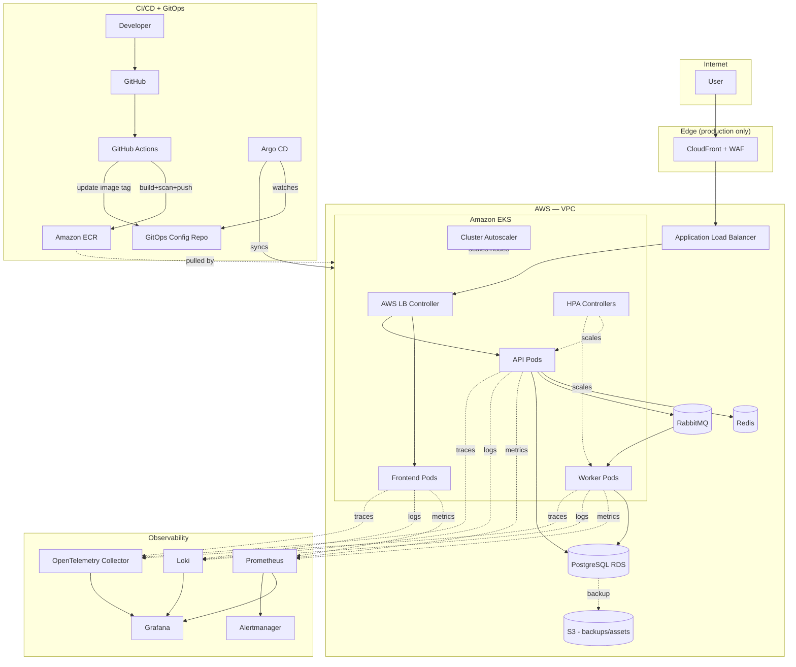
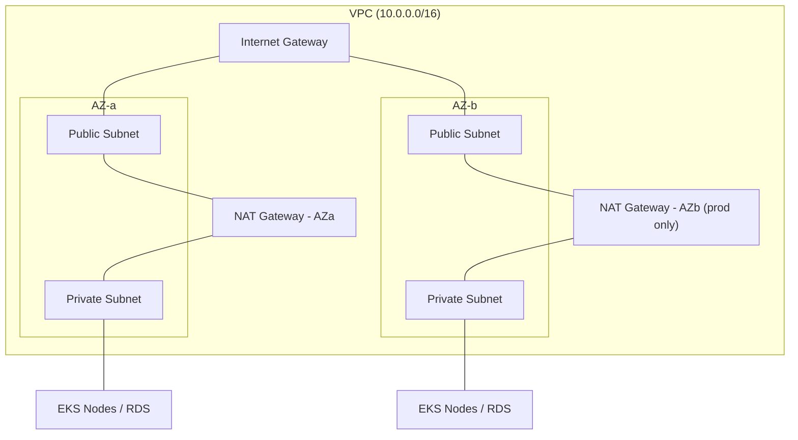
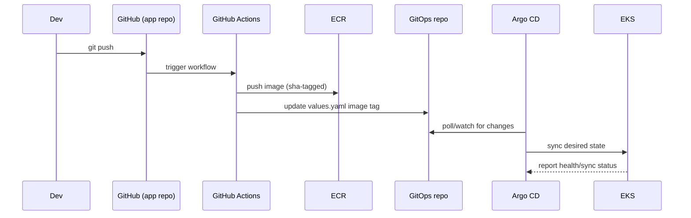
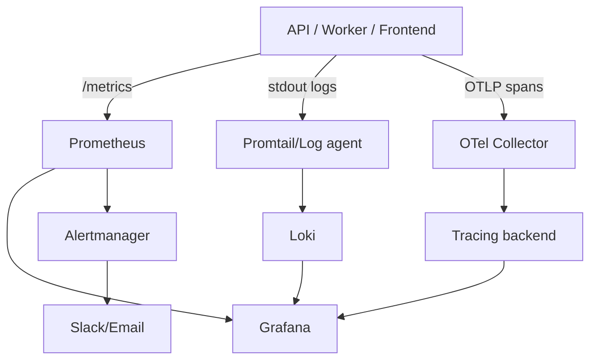
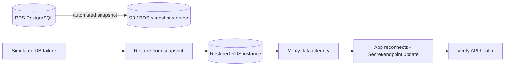

# KubeForge — Phase 1: Architecture & Planning

> **Status:** Planning document only. No infrastructure, application, or pipeline code has been written yet. Nothing here should be treated as "done" until it's built and verified in later phases.

---

## 1. Project Overview

**KubeForge** is a single, coherent, production-style platform that demonstrates the full lifecycle of running a distributed application on Kubernetes: from infrastructure provisioning through CI/CD, GitOps delivery, autoscaling, observability, security, and disaster recovery.

It is not a demo app with Kubernetes bolted on. The application (`KubeForge API`) is deliberately thin — a Node.js/TypeScript service with a worker and a minimal frontend — so that the majority of engineering effort goes into the *platform*: how the system is provisioned, deployed, scaled, observed, secured, broken on purpose, and recovered.

Everything in this document (AWS, Kubernetes, CI/CD, GitOps, observability, SRE, security, DR) is a **feature of one repository and one system**, not separate projects.

---

## 2. Problem Statement

Junior DevOps/SRE/Platform candidates are usually screened for whether they've *actually operated* a system, not just deployed one. Most portfolio projects stop at "app runs in a container" or "app runs in Kubernetes." They rarely show:

- What happens when a dependency (Redis, Postgres) goes down
- Whether autoscaling actually triggers under real load
- Whether alerts fire correctly and at the right threshold
- Whether a database can actually be restored from backup, not just "backed up"
- Whether a deployment can be rolled back safely
- Whether the engineer can read logs/metrics/traces together during an incident

KubeForge exists to close that gap: every claim in the final documentation and resume must be backed by something that was actually run and measured, not asserted.

---

## 3. Project Objectives

By the end of the project, KubeForge should:

1. Provision AWS infrastructure entirely through Terraform, reproducibly (`apply` / `destroy`).
2. Run a three-service distributed app on EKS with production-grade Kubernetes configuration (probes, resource limits, PDBs, RBAC, network policies).
3. Ship code via a CI pipeline that lints, tests, scans, builds, and pushes immutable images — with no long-lived AWS keys.
4. Deploy via GitOps (Argo CD) with drift detection and rollback, not `kubectl apply` from a laptop.
5. Autoscale under real, measured load — not theoretical claims.
6. Provide full observability: metrics, logs, and traces correlated by request ID / trace ID.
7. Define and calculate real SLIs/SLOs/error budgets from collected data.
8. Survive and document at least four induced failure scenarios.
9. Prove disaster recovery by actually restoring a database from backup and measuring RTO/RPO.
10. Produce documentation, runbooks, and resume bullets built only from real, measured evidence.

---

## 4. Complete Architecture (Narrative)

The system has four planes, all part of one platform:

- **Delivery plane** — how code becomes a running container (GitHub → Actions → ECR → Argo CD → EKS)
- **Runtime plane** — how the application actually runs and serves traffic (ALB → EKS → API/Worker/Frontend → Redis/RabbitMQ/RDS)
- **Observability plane** — how we know what the runtime plane is doing (Prometheus/Loki/OTel → Grafana → Alertmanager)
- **Resilience plane** — how the system survives and recovers from failure (HPA, PDBs, backups, DR procedure)

### Proposed refinements to the original architecture

The original architecture is sound and I'm keeping it as the base. A few additions are needed to make it *actually work* in practice, and one item is flagged as optional. Each is explained so you can decide, and can explain it in an interview:

| # | Refinement | Why |
|---|---|---|
| 1 | Add **AWS Load Balancer Controller** as the explicit component that turns a Kubernetes `Ingress` resource into a real ALB | "ALB" alone isn't something Kubernetes talks to natively — this controller is the missing link and is a very common interview question ("how does K8s Ingress become an AWS ALB?"). |
| 2 | Add **Cluster Autoscaler** (or Karpenter) alongside HPA | HPA (Section 9) only scales **pod count**. If there's no room on existing nodes, pods stay `Pending`. Node-level autoscaling is a separate, commonly-confused concept — good to demonstrate you know the difference. |
| 3 | Add **kube-prometheus-stack** as the concrete way Prometheus + Grafana + Alertmanager + node-exporter + kube-state-metrics get installed | Rather than hand-installing four separate tools, this is the real-world standard Helm chart. Worth naming explicitly since you'll reference it in Phase 11. |
| 4 | Add **External Secrets Operator** (pulls from AWS Secrets Manager) as the preferred pattern over raw Kubernetes `Secrets` | Native K8s Secrets are base64, not encrypted-by-default at rest without KMS envelope encryption enabled on the cluster. Using Secrets Manager + ESO is what most real platform teams do and is worth demonstrating. Raw K8s `Secrets` are still used for the rendering (Section 8) — ESO just becomes the *source*. |
| 5 | Mark **CloudFront as optional in dev/staging** | CloudFront in front of an ALB is mainly valuable for static asset caching (frontend) and edge/WAF protection, not for a dynamic API. I'd deploy it for the `production` environment (and to demonstrate you understand CDN/edge concepts) but skip it in `dev` to reduce cost and complexity while iterating. |
| 6 | **Single NAT Gateway in dev, one-per-AZ in production** | One of the largest recurring AWS costs (Section 18). Single NAT is fine for a personal dev environment; multi-AZ NAT is the "correct" production answer and worth showing you know the trade-off (cost vs. AZ failure blast radius). |
| 7 | **RDS single-AZ in dev, Multi-AZ in production** | Same cost/HA trade-off as above, explicitly configurable per environment via Terraform variables. |
| 8 | Add **Argo Rollouts** as the concrete mechanism for the canary strategy in Section 13 | "Canary deployment" isn't native to plain Kubernetes Deployments — Argo Rollouts (or a service mesh) is what actually implements weighted traffic shifting and automated analysis-based rollback. This slots into the roadmap around Phase 9. |

Nothing else changes. The rest of this document assumes the original diagram plus these eight additions.

---

## 5. Architecture Diagram



---

## 6. Component-by-Component Explanation

| Component | Purpose | Why this choice |
|---|---|---|
| **VPC (multi-AZ)** | Network isolation, public/private subnet split | Standard, minimal-cost way to demonstrate real network segmentation |
| **EKS** | Managed Kubernetes control plane | Industry-standard managed K8s; AWS-native IAM integration (IRSA) |
| **ECR** | Private container registry | Native AWS integration, IAM-scoped pull/push |
| **ALB + AWS LB Controller** | L7 routing, TLS termination, path/host routing to services | Native AWS ingress path; avoids running a separate load balancer inside the cluster |
| **RDS PostgreSQL** | Primary datastore | Managed backups, Multi-AZ failover, matches "real production DB" expectations |
| **Redis (self-hosted in-cluster, or ElastiCache)** | Caching + rate limiting | Demonstrates cache-aside pattern and a dependency-failure scenario |
| **RabbitMQ (self-hosted in-cluster)** | Async job queue between API and Worker | Demonstrates decoupled, message-driven architecture |
| **Terraform** | Infrastructure as Code | Reproducible `apply`/`destroy`, the de-facto industry standard |
| **Helm** | Kubernetes packaging | Environment-specific values, single source of truth for manifests |
| **Argo CD** | GitOps continuous delivery | Declarative, auditable, drift-detecting deployment vs. imperative `kubectl apply` |
| **Argo Rollouts** | Canary/progressive delivery | Automated, metric-gated rollout and rollback |
| **GitHub Actions + OIDC** | CI + keyless AWS auth | No long-lived AWS credentials in CI, matches current best practice |
| **Prometheus** | Metrics collection | Pull-based, the standard for Kubernetes metrics |
| **Grafana** | Dashboards | Unifies metrics, logs, and traces in one pane |
| **Loki** | Log aggregation | Cheap, label-based (like Prometheus but for logs), pairs naturally with Grafana |
| **OpenTelemetry** | Distributed tracing | Vendor-neutral, traces the full Redis → RabbitMQ → Worker → Postgres path |
| **Alertmanager** | Alert routing/dedup | Standard companion to Prometheus |

---

## 7. AWS Architecture



Key decisions:
- **Public subnets**: ALB, NAT Gateway(s) only. Nothing application-level is internet-facing directly.
- **Private subnets**: EKS worker nodes, RDS, ElastiCache (if used). No direct route to the internet — outbound only via NAT.
- **IAM**: separate least-privilege roles for (a) EKS cluster, (b) EKS node group, (c) GitHub Actions OIDC role (ECR push + nothing else), (d) IRSA roles per pod that needs AWS access (e.g., External Secrets Operator reading Secrets Manager).
- **Security groups**: ALB SG allows 443 from internet; node SG allows traffic only from ALB SG and within-cluster; RDS SG allows traffic only from the node SG.

---

## 8. Kubernetes Architecture

- **Namespaces**: `kubeforge` (app), `monitoring` (observability stack), `argocd`, `ingress` (or reuse controller's default).
- **Workloads**: `Deployment` for frontend/api/worker, each with 2–3 replicas minimum in staging/prod.
- **Services**: `ClusterIP` for internal routing; `Ingress` (ALB-backed) for external entry to frontend/api.
- **Config**: `ConfigMap` for non-secret settings (log level, feature flags); `Secret` (populated via External Secrets Operator) for DB/Redis/RabbitMQ credentials.
- **Reliability**: `PodDisruptionBudget` per deployment (e.g., `minAvailable: 1`), topology spread constraints across AZs, `readinessProbe`/`livenessProbe`/`startupProbe` per container, explicit `resources.requests` and `resources.limits`.
- **Security**: `securityContext` with `runAsNonRoot: true`, read-only root filesystem where possible, `NetworkPolicy` default-deny plus explicit allow rules (api → redis, api → rds, api → rabbitmq, worker → rabbitmq, worker → rds), RBAC scoped per service account, no use of the `default` service account for app workloads.

---

## 9. CI/CD Architecture

```mermaid
flowchart LR
    Push[git push] --> Checkout
    Checkout --> Install
    Install --> Lint
    Lint --> Test[Unit Tests]
    Test --> SAST[Security Scan / Gitleaks]
    SAST --> Build[Docker Build]
    Build --> Trivy[Trivy Image Scan]
    Trivy --> OIDC[Assume AWS Role via OIDC]
    OIDC --> Push2[Push to ECR - tag: git SHA]
    Push2 --> UpdateManifest[Update image tag in GitOps repo]
```



No `AWS_ACCESS_KEY_ID` / `AWS_SECRET_ACCESS_KEY` anywhere. GitHub's OIDC token is exchanged for temporary credentials via an IAM role trust policy scoped to this specific repo. Images are tagged with the Git SHA — `latest` is never deployed.

---

## 10. GitOps Architecture

Two repositories (or two directories in one repo, decided during Phase 8):

- **App repo**: application source + Dockerfiles + CI workflow.
- **GitOps repo**: rendered Helm values / manifests per environment, watched by Argo CD.



Argo CD gives: automated sync, drift detection (cluster state vs. Git state), and one-click/automated rollback to any previous Git commit — the actual mechanism behind "rollback" in Section 13.

---

## 11. Observability Architecture



Correlation is the key design goal: every log line carries `requestId` and `traceId`, so an alert (Alertmanager) → dashboard (Grafana) → logs (Loki, filtered by `traceId`) → trace (span breakdown) path is walkable end-to-end during a real incident, not just theoretically possible.

---

## 12. Security Architecture

Defense in depth, top to bottom:

1. **Edge**: WAF (via CloudFront, prod only), ALB security group restricting inbound to 443.
2. **Identity**: GitHub OIDC (no static keys), IRSA for pod-level AWS access, least-privilege IAM per role.
3. **Cluster**: RBAC per service account, network policies (default-deny + explicit allow), no privileged containers, non-root, read-only root filesystem.
4. **Secrets**: AWS Secrets Manager as source of truth, synced via External Secrets Operator — nothing sensitive committed to Git.
5. **Supply chain**: Gitleaks (secret scanning in CI), dependency scanning (`npm audit` / Dependabot), Trivy (container image CVEs), `tfsec`/`checkov` (Terraform misconfig scanning).
6. **Immutable delivery**: SHA-tagged images only, GitOps as the only path to production (no manual `kubectl apply`).

---

## 13. Disaster Recovery Architecture



Target: **RPO ≤ 15 min, RTO ≤ 30 min** — both will be *measured*, not assumed, in Phase 17 by actually triggering a restore and timing it end-to-end (snapshot → new instance available → app reconnected → health check green).

---

## 14. Repository Structure

```text
kubeforge/
├── services/
│   ├── api/
│   ├── worker/
│   └── frontend/
├── infrastructure/
│   └── terraform/
│       ├── modules/{vpc,eks,iam,ecr,rds,s3}/
│       └── environments/{dev,staging,production}/
├── helm/
│   └── kubeforge/{Chart.yaml,values.yaml,values-*.yaml,templates/}
├── gitops/
│   └── environments/{dev,staging,production}/
├── monitoring/
│   ├── prometheus/  ├── grafana/  ├── loki/  └── alertmanager/
├── .github/workflows/
├── docs/
│   ├── architecture.md   ├── deployment.md   ├── observability.md
│   ├── security.md       ├── disaster-recovery.md
│   ├── troubleshooting.md
│   └── runbooks/
├── scripts/
├── README.md
└── LICENSE
```

No changes to the proposed structure — it already separates concerns cleanly by concern (app / infra / delivery / config / observability / docs), which is exactly how a real platform team would lay it out.

---

## 15. Development Roadmap

| Phase | Focus | Primary Output |
|---|---|---|
| 1 | Architecture & Planning | This document |
| 2 | Application Foundation | API/worker/frontend skeletons, health endpoints |
| 3 | Docker | Multi-stage, non-root, small Dockerfiles |
| 4 | Local Kubernetes | App running on kind/minikube |
| 5 | Terraform AWS Infrastructure | VPC, EKS, ECR, RDS, S3 via modules |
| 6 | EKS Deployment | App running on real EKS |
| 7 | GitHub Actions CI | Lint/test/scan/build/push, OIDC |
| 8 | Argo CD GitOps | Automated sync from GitOps repo |
| 9 | Production K8s Config | Probes, RBAC, NetworkPolicy, PDB, canary via Argo Rollouts |
| 10 | Autoscaling | HPA + Cluster Autoscaler, load-tested |
| 11 | Prometheus & Grafana | kube-prometheus-stack, real dashboards |
| 12 | Loki Logging | Structured logs, searchable during incidents |
| 13 | OpenTelemetry | End-to-end request tracing |
| 14 | Alerting | Alertmanager rules, Slack/email routing |
| 15 | SRE SLO/Error Budget | Real SLI data → SLO → burn rate |
| 16 | Security/DevSecOps | Trivy, Gitleaks, tfsec, ESO, IAM audit |
| 17 | Disaster Recovery | Actual backup + restore test, measured RPO/RTO |
| 18 | Load Testing | k6 results, HPA behavior under load |
| 19 | Failure/Incident Testing | The four failure scenarios, documented |
| 20 | Documentation & Resume | README, runbooks, real-metric resume bullets |

---

## 16. Prerequisites

- AWS account with billing alerts configured (Section 18 — this project costs real money if left running)
- AWS CLI, `kubectl`, `helm`, `terraform`, `docker`, `argocd` CLI installed locally
- GitHub account/repo with Actions enabled
- Working knowledge of: Linux basics, Docker fundamentals, YAML, basic networking (CIDR, subnets), and either JavaScript/TypeScript or willingness to learn alongside the project
- No prior Kubernetes or AWS production experience required — that's the point of the project

---

## 17. Expected Learning Outcomes

- Provisioning cloud infrastructure safely and reproducibly with Terraform
- Operating a real Kubernetes cluster, not just deploying to one
- Building a CI/CD pipeline with keyless cloud authentication
- Practicing GitOps as the deployment model, including rollback
- Reading and correlating metrics, logs, and traces during an incident
- Defining SLOs and calculating error budgets from real data
- Diagnosing and documenting real Kubernetes failure modes
- Executing and timing an actual disaster recovery procedure
- Writing resume bullets that are defensible in an interview because they're backed by real measurements

---

## 18. Expected AWS Costs (Dev Configuration)

| Resource | Approx. monthly cost (dev, if left running) | Notes |
|---|---|---|
| EKS control plane | ~$73/mo | Fixed cost per cluster, regardless of size |
| EC2 (2× t3.medium nodes) | ~$60/mo | Can scale to 1 node or spot instances for cost |
| NAT Gateway (single, dev) | ~$32/mo + data | Biggest avoidable cost — destroy when not in use |
| RDS (db.t3.micro, single-AZ) | ~$15/mo | Multi-AZ roughly doubles this |
| ALB | ~$16/mo + traffic | |
| ECR | ~$1/mo | Storage-based, negligible at small scale |
| S3 | <$1/mo | Backups/state, negligible at small scale |
| CloudWatch | Variable, low at this scale | |
| **Approx. total (dev, running)** | **~$200/mo** | |

**This is a "destroy when not actively working on it" project.** `terraform destroy` between sessions is the expected workflow — the whole point of Phase 5's design is that the environment is disposable. Only spin up `staging`/`production`-tier configs (Multi-AZ RDS, per-AZ NAT, CloudFront) for the specific phases that need to demonstrate them (load testing, DR, canary), then tear back down.

---

## 19. DevOps/SRE Skills Demonstrated

| Category | Skills |
|---|---|
| **AWS** | VPC design, EKS, IAM/IRSA, ECR, ALB, RDS, S3 |
| **IaC** | Terraform modules, remote state, multi-environment config |
| **Containers** | Multi-stage Docker builds, image hardening |
| **Kubernetes** | Deployments, Services, Ingress, HPA, RBAC, NetworkPolicy, PDB, probes |
| **CI/CD** | GitHub Actions, OIDC, image scanning, immutable tags |
| **GitOps** | Argo CD, Argo Rollouts, drift detection, rollback |
| **Observability** | Prometheus, Grafana, Loki, OpenTelemetry, Alertmanager |
| **SRE** | SLI/SLO/error budget, MTTD/MTTR, incident response, runbooks |
| **DevSecOps** | Trivy, Gitleaks, tfsec, Secrets Manager, least-privilege IAM |
| **Resilience** | Chaos/failure testing, disaster recovery, measured RTO/RPO |

---

## 20. Potential Interview Questions

**AWS/Terraform**
- Walk me through how traffic reaches a pod from the internet in your architecture.
- Why private subnets for EKS nodes and RDS? What's a NAT Gateway actually doing?
- How does Terraform state work, and why remote state with locking?

**Kubernetes**
- What's the difference between a liveness and a readiness probe, and what breaks if you get them backwards?
- How does HPA decide to scale, and what happens if there's no room on existing nodes?
- Walk me through what happens when you `kubectl delete pod` on a Deployment-managed pod.

**CI/CD & GitOps**
- Why OIDC over long-lived AWS keys in CI?
- What's the actual difference between GitOps and "CI/CD that runs kubectl apply"?
- How would you roll back a bad deployment in your setup?

**Observability & SRE**
- How did you calculate your error budget, and what does burning it mean operationally?
- Walk me through your incident response for the Redis-down scenario, using your own logs/metrics.
- What's the difference between MTTD and MTTR, and how did you measure them?

**Security**
- What does least-privilege IAM look like in your setup, concretely?
- How are secrets handled from AWS Secrets Manager into a running pod?

**Disaster Recovery**
- What's your actual measured RTO/RPO, and how did you test it?

---

## 21. Definition of Done (Phase 1)

Phase 1 is complete when:
- [x] Architecture is fully diagrammed and every component's purpose is explained
- [x] All architectural refinements to the original spec are documented with rationale
- [x] Repository structure is finalized
- [x] 20-phase roadmap is defined
- [x] Cost model and destroy-when-idle strategy are documented
- [x] Skills/interview mapping exists to guide what to emphasize in each phase

**Overall project Definition of Done** (for later phases, listed here for reference): infrastructure provisions and destroys cleanly via Terraform; app runs on EKS via GitOps only; CI has zero long-lived credentials; HPA scaling is demonstrated under real k6 load with recorded numbers; dashboards show real traffic, not synthetic screenshots; all four failure scenarios are documented with real command output; a real DR restore has been performed and timed; every resume bullet traces back to a number actually produced by the system.

---

**Next step:** say "Proceed to Phase 2" when ready to start the Application Foundation phase.
